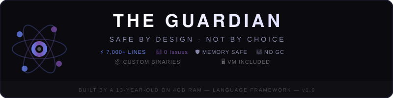
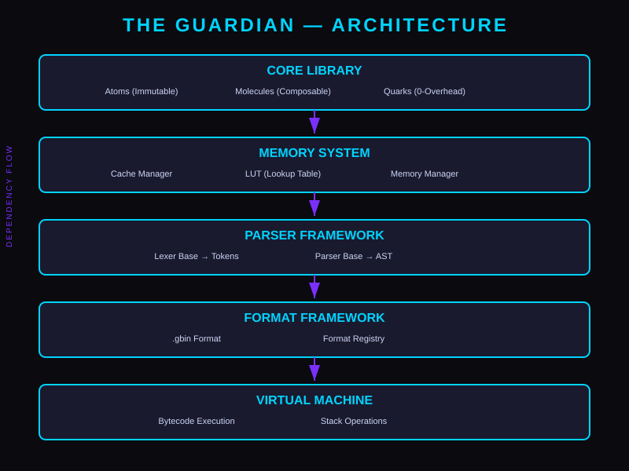

# 🔷 The Guardian — Language Framework

<p align="center">
  
</p>

<br>

**Build custom languages with memory safety, custom binary formats, and a VM.**

The Guardian is a **language development framework** that provides everything you need to build your own programming language:

- 🧬 **Core** — Atoms, Molecules, Quarks for type-safe data
- 💾 **Memory** — Cache, LUT, Memory Manager for safety
- 📝 **Parser** — Lexer/Parser base classes
- 💿 **Format** — Custom binary formats (.gbin)
- 🖥️ **VM** — Bytecode execution

## Why The Guardian?

| Feature | The Guardian | Other Frameworks |
|---------|--------------|------------------|
| Custom binary formats | ✅ Built-in | ❌ |
| Memory safety (LUT) | ✅ | ❌ |
| VM execution | ✅ | ✅ |
| No Garbage Collection | ✅ | ❌ |
| Modern C++17 API | ✅ | ⚠️ |
| Nested data structures | ✅ | ⚠️ |
| System-wide installation | ✅ | ❌ |
| Built-in language demo | ✅ (Axiom) | ❌ |
| Size | ~7,000 lines | 100,000+ lines |
| Built by a 13-year-old | ✅ | ❌ |
| Price | $20 one-time | $500+ |

## 💰 Pricing

| License | Price | Type | Who |
|---------|-------|------|-----|
| Personal/Educational | **FREE** | One-time | Students, open-source, learning |
| Commercial | **$20** | One-time | One commercial project |
| Enterprise | **$99/year** | Subscription | Unlimited commercial projects |

[👉 Buy Commercial License ($20)](https://kashiflyas.gumroad.com/l/ekhyi)

## Quick Start

```bash
# Install
git clone https://github.com/Taha95-dev/The-Guardian.git
cd The-Guardian
make build
sudo make install
```
# Test
guardianc --version

Build a language

cpp

#include <guardian/core/atom.hpp>
#include <guardian/core/molecule.hpp>
#include <guardian/parser/parser.hpp>
#include <guardian/format/gbin_format.hpp>
#include <guardian/vm/vm.hpp>

// Your language here!

Documentation

    User Guide

    Architecture

    API Reference

    Tutorials

License

The Guardian is licensed under The Guardian License v1.0:

    ✅ FREE for personal, educational, and open-source use

    💼 Commercial use requires a license (contact via GitHub Issues)

    🚫 No selling The Guardian as your own product

See LICENSE.md for full details.
Commercial Licensing
License Type	Price	Use Cases
Individual	$99/year	One commercial project
Small Business	$499/year	Up to 5 commercial projects
Enterprise	$2,499/year	Unlimited commercial projects
OEM/Reselling	Contact me	Resell as part of your product

Contact: Open an issue
Built by Taha — 13-year-old developer building the future of code.


## Documentation

- [Security Model](docs/security_model.md) — Learn about memory safety and security
- [Tutorial](docs/tutorial.md) — Build your first language with The Guardian
- [User Guide](docs/user-guide/) — Complete documentation
- [Architecture](docs/architecture/) — How The Guardian works
- [API Reference](docs/api/) — Full API documentation

## Architecture



The Guardian is built as a layered, modular framework. See the [full architecture documentation](docs/architecture.md) for details.

---

## Documentation

- [Architecture Overview](docs/architecture.md) — How The Guardian works
- [Security Model](docs/security_model.md) — Learn about memory safety
- [Tutorial](docs/tutorial.md) — Build your first language
- [User Guide](docs/user-guide/) — Complete documentation
- [API Reference](docs/api/) — Full API docs
- [Contributing Guide](CONTRIBUTING.md) — How to contribute
- [Changelog](CHANGELOG.md) — Version history
